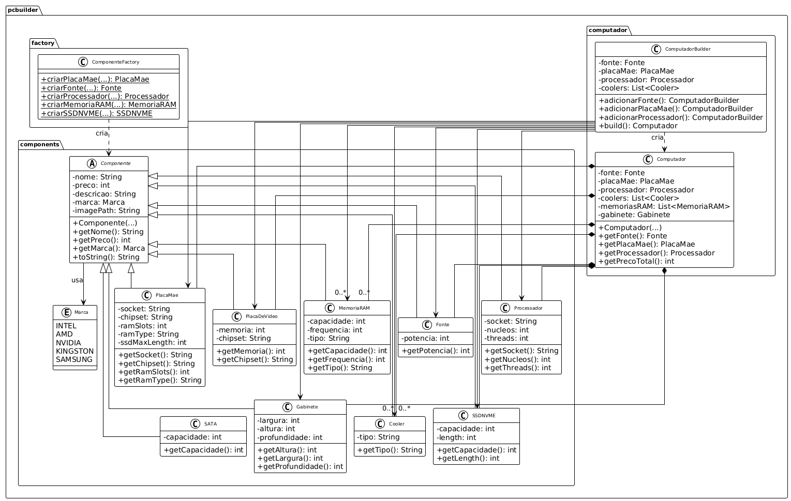

# Projeto Montagem de Computadores

Este projeto é uma aplicação Java que permite que um **cliente monte seu próprio computador** escolhendo peças compatíveis, enquanto a **loja pode cadastrar novos componentes**.


## Diagrama UML do projeto:



## 💡 Visão Geral

A aplicação é dividida logicamente em duas áreas:

- **Cliente**: pode montar um computador com base nas peças disponíveis.
- **Loja**: pode cadastrar, editar e gerenciar componentes.

## 📦 Estrutura do Projeto

```
src/
├── main/
│   ├── java/
│   │   ├── pcbuilder/
│   │   │   ├── compatibility/
│   │   │   │   └── Compativel.java
│   │   │   ├── components/
│   │   │   │   │   ├── Componente.java
│   │   │   │   ├── PlacaMae.java
│   │   │   │   ├── Processador.java
│   │   │   │   ├── PlacaVideo.java
│   │   │   │   ├── MemoriaRAM.java
│   │   │   │   ├── Marca.java
│   │   │   │   ├── Fonte.java
│   │   │   │   ├── Cooler.java
│   │   │   │   ├── Gabinete.java
│   │   │   │   ├── SATA.java
│   │   │   │   └── SSDNVME.java
│   │   │   ├── computador/
│   │   │   │   ├── Computador.java
│   │   │   │   └── ComputadorBuilder.java
│   │   │   ├── factory/
│   │   │   │   └── ComponenteFactory.java
│   │   │   ├── usuario/
│   │   │   │   ├── Usuario.java
│   │   │   │   └── Role.java
│   │   │   ├── exceptions/
│   │   │   │   ├── ComponentesEssenciaisFaltandoException.java
│   │   │   │   └── ComponentesIncompatíveisException.java
│   │   │   ├── ui/
│   │   │   │   └── [...] // Arquivos da interface
│   │   │   ├── service/
│   │   │   │   └── [...] // Inicialização de alguns objetos
│   └── resources/fxml
│   │   └── [...] // Arquivos da interface
└── test/java/pcbuilder
│   └── [...] // Arquivos de teste
```

## 🛠️ Funcionalidades implementadas

- Representação de componentes como classes que herdam de `Componente`.
- Compatibilidade entre peças (ex: socket do processador e placa-mãe).
- Builder Pattern para montagem de computadores.
- Factory Pattern para criação de componentes na interface da loja.
- Classe `Usuario` com tipoUsuario para diferenciar qual interface abrir.

## 🧱 Design Patterns Utilizados

- **Builder**: permite construir objetos `Computador` passo a passo.
- **Factory**: abstrai a criação de diferentes componentes.

## ▶️ Como Executar

1. Clone o projeto:

```bash
git clone https://github.com/josepaliares/MonteSeuPc-ProjetoMC322.git
cd MonteSeuPc-ProjetoMC322
```

2. Compile e execute com Gradle:

```bash
./gradlew build
./gradlew run
```